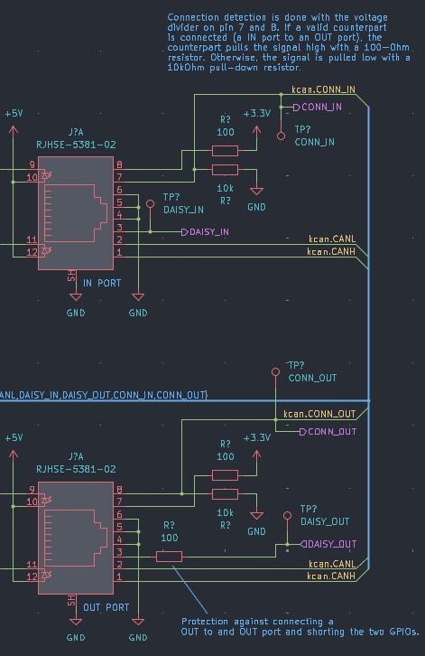

# KnabberCAN protocol

[TOC]

## Goals

KnabberCAN aims to solve the following problems:
- Automatic, decentralized addressing
- Low firmware overhead by effective message filtering
- Fast data transfer
- High reliability
- Simple implementation

The protocol designated to fulfill these requirements is specified below.

## Hardware

### Connector

The connector used is a standard 8P8C (RJ45) connector, as also used for ethernet
jacks.

Every node has two of those connectors, one labelled as `IN`, the other one as `OUT`. This is to allow daisy-chaining of nodes.

### Signals

KnabberCAN is based on the CAN interface, and therefore uses the following signals:

- `CANH`
- `CANL`

However, this is extended with the following signals:

- `DAISY`
- `CONN`

The circuitry connected to those signals is dependent on the connector (IN or OUT).

`CANH` and `CANL` are connected to the respective CAN transceiver circuitry on the node.

#### CONN signal
The `CONN` signal is used for connection detection. It aims to provide the CAN node with a HIGH signal when a matching port is connected to the port. Every knabberCAN node will receive two `CONN` signals, one for each connector.

The `CONN` signals are placed on pin 7 and 8 of the connector. They are connected to +3.3V and GND using resistors.

When an `IN` and an `OUT` port are connected, both `CONN` signals will assert as HIGH. This is due to the 100 Ohm resistor pulling the signal on high, overriding the 10 kiloohm pull-down resistor.

#### DAISY signal
Every connector also features a `DAISY` signal on pin 3. This signal is used mainly for addressing. It must be used as an output on the `OUT` port and as an input on the `IN` port. To avoid damage on micrcontroller outputs, it is connected through a 100 Ohm resistor on the `OUT` port.

## Addressing scheme

The CAN frames are addressed using a 7-bit node identifier which is assigned dynamically during addressing. The node identifier increments for each node of the knabberCAN bus, from the first `OUT` port to the last `IN` port.

| Address       | Use                       |
| ------------: | :------------------------ |
| 0             | Broadcast / Debugging     |
| 1 - 127       | Node address n            |

When sending a frame, address 0 may be used for debugging purposes (i. e. when sending frames from a CAN interface which doesn't have a knabberCAN address assigned to it).

## Frame types

The knabberCAN protocol defines the following frame types:

- `EVENT`
- `ERROR`
- `COMMAND`
- `RESPONSE`

## CAN identifier

knabberCAN uses the 29-bit extended identifier as defined by the CAN interface. The identifier is structured according to the following structure.

| 29-Bit CAN identifier |||||||||||||||||||||||||||||
| :-: | :-: | :-: | :-: | :-: | :-: | :-: | :-: | :-: | :-: | :-: | :-: | :-: | :-: | :-: | :-: | :-: | :-: | :-: | :-: | :-: | :-: | :-: | :-: | :-: | :-: | :-: | :-: | :-: |
| 28 | 27 | 26 | 25 | 24 | 23 | 22 | 21 | 20 | 19 | 18 | 17 | 16 | 15 | 14 | 13 | 12 | 11 | 10 | 9 | 8 | 7 | 6 | 5 | 4 | 3 | 2 | 1 | 0 |
| `FT[0:1]` || `FIRST` | `LAST` | `FRC[0:2]` ||| `TID[0:7]` |||||||| `SADR[0:6]` ||||||| `RADR[0:6]` |||||||

### FT[0:1] - Frame type

The first bit field in the CAN identifier describes the type of the frame. It is defined as following:

| FT[0:1] | Description             |
| :------ | :---------------------- |
| 0       | `EVENT`                 |
| 1       | `COMMAND`               |
| 2       | `RESPONSE`              |
| 2       | `ERROR`                 |

### FIRST - First frame flag
This flag is set when this frame is the first CAN frame in the knabberCAN frame.

### LAST - Last frame flag
This flag is set when this frame is the last CAN frame in the knabberCAN frame.

### FRC[0:2] - Frame counter
The frame counter is initialized to 0 at the start of every knabberCAN frame and is incremented for every CAN frame sent. This allows for detecting dropped CAN frames. Upon reaching 7, the frame counter overflows to 0 again.

### TID[0:7] - Transaction ID
The transaction ID is dependent on the frame type and maps to the structure and length of the payload. For events, this is the event ID, for commands and responses, this is the command ID, and for errors, this corresponds to the error code.

### SADR[0:6] - Sender address
Contains the address of the node which sent the frame.

@note In normal operation, this may not be set to 0.

### RADR[0:6] - Receiver address
Contains the address of the node which should receive the frame.

### Other CAN bitfields
The following bitfields defined by the CAN protocol must be set as follows:

| Bitfield | Value | Description                              |
| :------- | :---- | :--------------------------------------- |
| RTR      | 0     | Remote frames are not used by knabberCAN |
| IDE      | 1     | Identifier is always extended (29-bit).  |

## Frame definitions

### Event frames
Event frames indicate an event which may be relevant to any node on the network, i.e. power-up or addressing-related events.

Which event has happened is indicated by the `TID` bits in the CAN identifier. The payload of event frames depends on the event id.

**Events can only be sent to address 0, i.e. broadcast.**

#### Event transaction IDs

| Transaction ID    | Payload           | Name                      |
| :---------------- | :---------------- | :------------------------ |
| **Addressing \*** |||
| `0x00`            | `void`            | `ADDRESSING_START`        |
| `0x02`            | `void`            | `ADDRESSING_SUCCESS`      |
| `0x03`            | `void`            | `ADDRESSING_NEXT`         |
| `0x04`            | `void`            | `ADDRESSING_FINISHED`     |
| **Power control** |||
| `0x10`            | `void`            | `ONLINE`                  |
| **Application-defined events** |||
| `0x40` .. `0xFF`  | Application-defined events.                  ||

***\* Refer to the documentation of the specific protocol feature (e.g. addressing) for more information.***

##### 0x10 - ONLINE
The `ONLINE` event is broadcasted automatically be the initialization procedure to indicate that a node has been powered up, addressed successfully, and is ready to receive frames.

### Command and response frames

Command frames trigger an action on a node and must be answered by a `REPORT` or an `ERROR` frame.

#### Command transaction IDs

| Transaction ID    | Command Payload           | Response Payload  | Name                      |
| :---------------- | :------------------------ | :---------------- | :------------------------ |
| **Power control** ||||
| `0x00`            | `void`                    | No response.      | `RESET`                   |
| **General device control** ||||
| `0x10`            | `bool`                    | No response.      | `SET_INDICATORS_ACTIVE`   |
| `0x11`            | `void`                    | `char[]`          | `READ_FWR_NAME`           |
| **Application-defined commands** ||||
| `0x40` .. `0xFF`  | Application-defined commands. |||

##### 0x00 - RESET
The `RESET` commands restarts the whole application running on a node, repeating the whole initialization procedure.

The `RESET` command is not confirmed by a response, but will trigger a `POWERUP` event due to the node being reinitialized.

**This command may only be broadcasted to the whole network, making every node repeat it's initialization routine.**

##### 0x10 - SET INDICATORS ACTIVE
Enables or disables the LED indicators of the node.

##### 0x11 - READ FIRMWARE NAME
Reads the name of the firmware running on a node. The payload consists of a single string containing the name of the firmware.

### Error frames

Error frames indicate a failure in the application's firmware.

| Transaction ID    | Name                  | Description                           |
| :---------------- | :-------------------- | :------------------------------------ |
| **Generic errors** |||
| `0x00`            | Reserved ||
| `0x01`            | `ERR_RUNTIME_GENERIC` | Generic runtime error.                |
| `0x02`            | `ERR_NOT_IMPLEMENTED` | Not-implemented error.                |
| `0x03`            | `ERR_OVERFLOW`        | Overflow error.                       |
| `0x04`            | `ERR_UNDERFLOW`       | Underflow error.                      |
| `0x05`            | `ERR_OVERRUN`         | Data overrun error.                   |
| `0x06`            | `ERR_BUFFER_FULL`     | Buffer full error.                    |
| `0x07`            | `ERR_BUFFER_EMPTY`    | Buffer empty error.                   |
| `0x08`            | `ERR_IMPOSSIBLE`      | Logically impossible arguments passed. |
| **knabberCAN errors** |||
| `0x09`            | `ERR_INVALID_FRAME`   | A knabberCAN frame was not able to be parsed. |
| **Application-defined errors** |||
| `0x40` .. `0xFF`  | Application-defined errors. ||

#### Payload

The payload of error frames contains an error message which can be specified by the application. The payload is composed entirely of a string containing the error message (not necessarily null-terminated).

## Addressing procedure

When a node is powered up, it must follow this procedure:

1. Initialize internal resources and CAN hardware
2. Assert if the `CONN_IN` signal is LOW. When `CONN_IN` is low, it performs the following steps:
    1. The node assigns address 1 to itself
    2. An `ADDRESSING_START` event is emitted indicating the addressing procedure has been started
    3. The node checks the `CONN_OUT` signal. If it is HIGH, it performs the following steps:
        1. The `DAISY_OUT` signal is set to HIGH for the next node
        2. The node starts emitting `ADDRESSING_NEXT` events repeatedly until it receives an `ADDRESSING_SUCCESS` event.
        3. The node waits for an `ADDRESSING_FINISHED` event to be received an then returns to the application.
    4. If `CONN_OUT` is LOW, the node emits an `ADDRESSING_FINISHED` event and returns to the application.
3. If `CONN_IN` is high, the node performs the following steps:
    1. The node waits for `DAISY_IN` to become HIGH.
    2. The node waits for an `ADDRESSING_NEXT` event to be received. It then assigns the next-higher address from the address of the node which sent the event to itself.
    3. The node emits an `ADDRESSING_SUCCESS` message with it's newly-assigned address.
    4. The node checks the `CONN_OUT` signal. If it is HIGH, it performs the following steps:
        1. The `DAISY_OUT` signal is set to HIGH for the next node
        2. The node starts emitting `ADDRESSING_NEXT` events repeatedly until it receives an `ADDRESSING_SUCCESS` event.
        3. The node waits for an `ADDRESSING_FINISHED` event to be received an then returns to the application.
    5. If `CONN_OUT` is LOW, the node emits an `ADDRESSING_FINISHED` event and returns to the application.

This results in every node being assigned a node ID incrementally from the first OUT port to the last IN port, accounting for varying boot times.

## Indicator LEDs

If the connectors on a node feature indicator LEDs, they must be used as follows:

| State                                         | Green LED usage           | Yellow LED usage              |
| :-------------------------------------------- | :------------------------ | :---------------------------- |
| **During addressing** |||
| Address assignment pending                    | Off                       | Off                           |
| Address assignment succeeded                  | On                        | Off                           |
| **After addressing** |||
| Frame received                                | Toggled                   | Unchanged                     |
| Frame transmitted                             | Unchanged                 | Toggled                       |
| Application crashed due to uncaught error     | Off                       | Blinking with 10 Hz           |